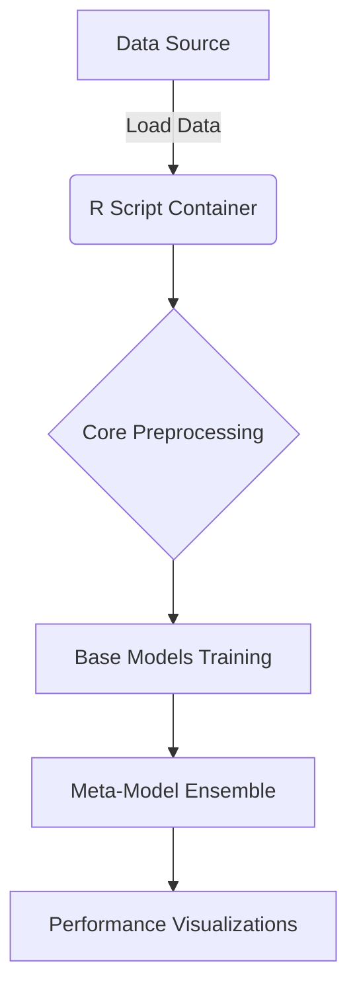

# r-project

This repository embodies strict enterprise engineering standards: resilient architecture, graceful error handling, and robust continuous integration.

## 🏗️ System Architecture



## 📦 Dependency Rationale

We use the rocker/tidyverse base image to ensure a consistent, reproducible environment for R. 
Key packages:
- **tidyverse**: For fast, readable data manipulation.
- **caret**: A unified interface for training multiple machine learning models.
- **randomForest**, **xgboost**, **gbm**: High-performance tree-based models.
- **keras**, **tensorflow**: Neural networks.

## 🚀 Setup Instructions

1. Ensure Docker and Docker Compose are installed.
2. Run the application via docker-compose:

```bash
docker-compose up --build -d
```

## 📂 Structure

- `src/`: Core logic and R scripts (e.g., model training and cleaning).
- `tests/`: Unit tests for model validation.
- `.github/workflows/`: Continuous integration configuration.
